# Human Resources Administration System

This project includes three microservices:
- authentication-microservice
- contract-microservice
- message-microservice

## Authentication-microservice

The `authentication-microservice` is responsible for registering new users and authenticating current ones. It also allows admins (HR) to get, add, update and delete users.

After successful authentication, this microservice will provide a JWT token which can be used to bypass the security. This token contains the *NetID* and the *Role* of the user that authenticated. Most of the functionalities can only be executed by HR and only if the correct JWT token is provided.

## Contract microservice

The `contract-microservice` is responsible for managing the contracts. Via this service you can propose, accept and terminate contracts. It relies on the authentication service for authentication, and the message service for sending notifications regarding contract events.

## Message microservice
The `message-microservice` is responsible for sending and opening messages (with or without attachments), retrieving inboxes and outboxes. The HR department got a common inbox where are messages regarding the HR department are listed.

To perform an action as HR, pass an additional request parameter `fromHr` with value `true` in the request. (Service verifies that the user is HR)
For specifics, refer to the documentation included in the code within the `message-microservice` folder.

The `domain` and `application` packages contain the code for the domain layer and application layer. The code for the framework layer is the root package as *Spring* has some limitations on were certain files are located in terms of auto-wiring.

## Running the microservices

You can run the three microservices individually by starting the Spring applications. Then, you can use *Postman* to perform the different requests:

Register (the role of the user will be EMPLOYEE):
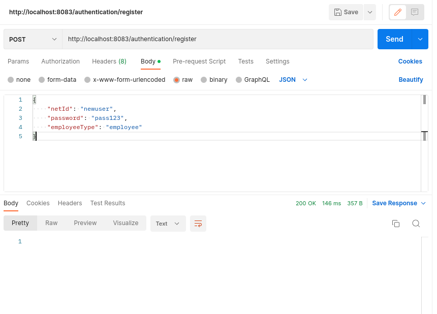

Register admin (the role of the user will be HR):

Authenticate:
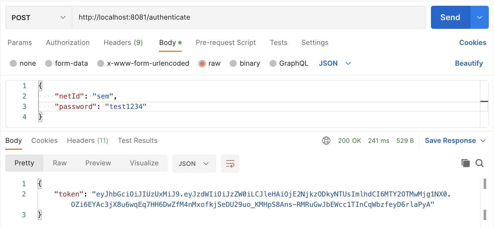

Hello:
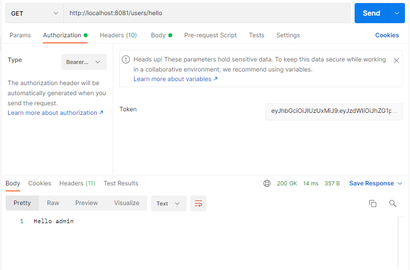

Additional requests:
All following requests need a token and only HR can execute these requests.

Add user:
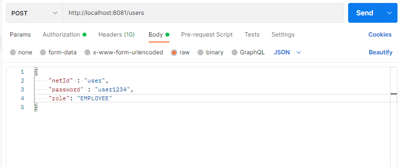

Get user:
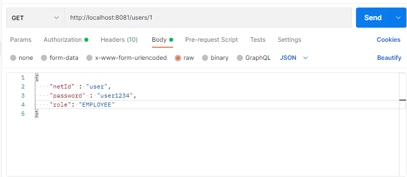

Delete user:
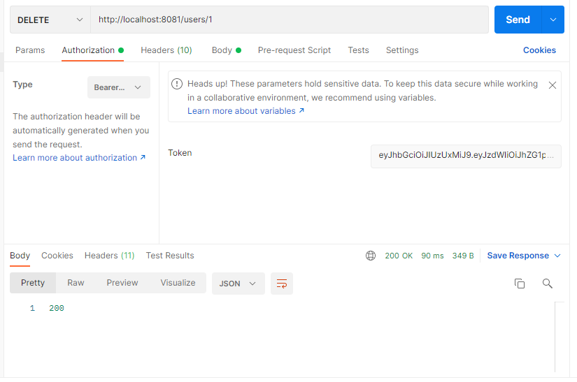

Create a new candidate and a corresponding initial proposal
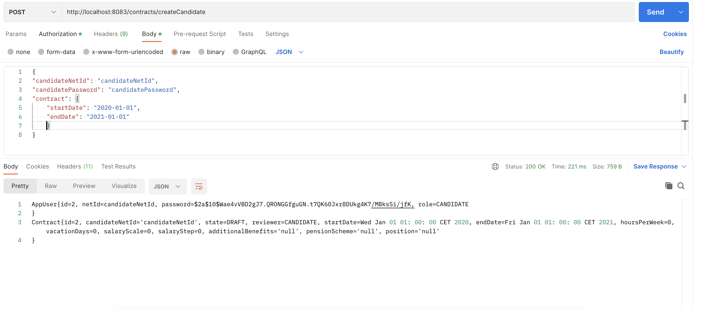

Create a new contract proposal
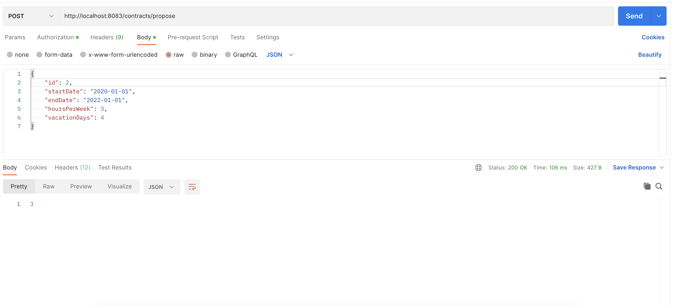

View all messages in the inbox
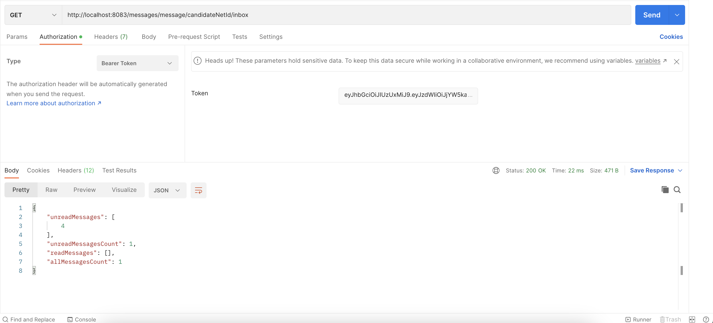

View a single message
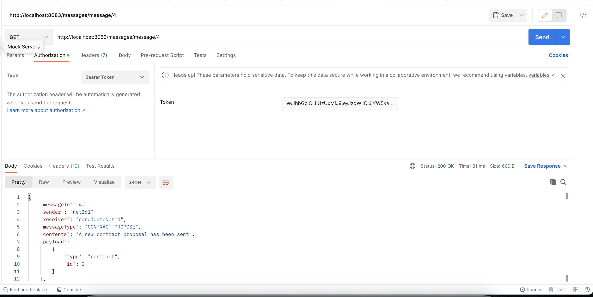

Terminate a contract (HR only)
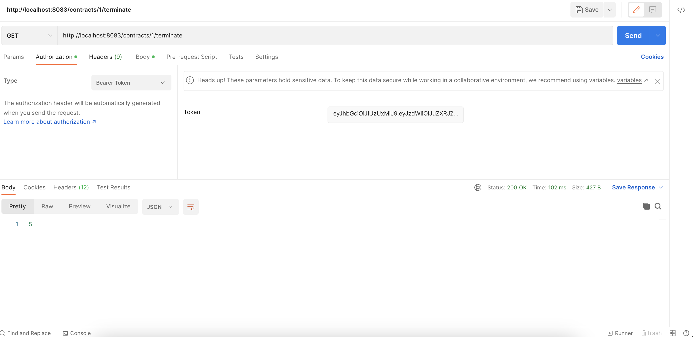
